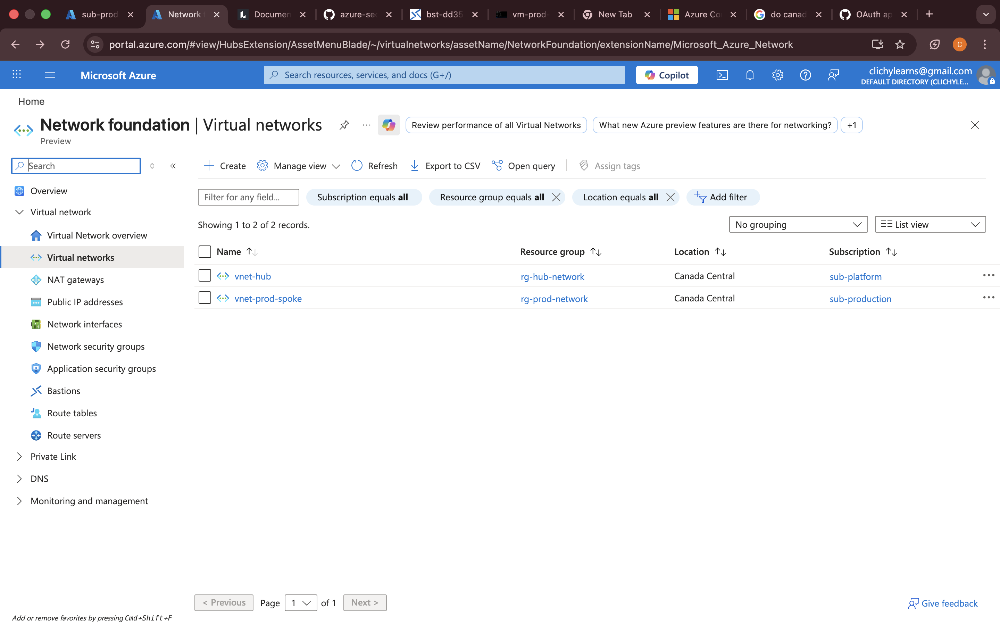

# Azure Secure Landing Zone (Terraform)

## Overview
This project demonstrates the design and implementation of an enterprise-grade Azure landing zone using Terraform. The architecture follows best practices for governance, security, and scalability, with a strong focus on private networking and zero public exposure.

## Architecture

- Hub-spoke network topology
- Centralized security with Azure Firewall
- Private endpoints for Storage and Key Vault
- No public access to workloads
- Bastion-based secure VM access
- Multi-subscription design (platform + production)

## Key Components

### Networking
- Virtual Network: vnet-prod-spoke (10.1.0.0/16)
- Subnets:
  - snet-app (10.1.1.0/24)
  - snet-private-endpoints (10.1.2.0/24)
- Hub VNet (vnet-hub) with shared services
- VNet peering between hub and spoke
- Route Table: rt-prod-app (forced tunneling via Azure Firewall)
- Network Security Group: nsg-prod-app

### Security
- Azure Firewall (centralized egress control)
- Azure Bastion (secure administrative access)
- Private Endpoints:
  - Storage (blob)
  - Key Vault
- Public network access disabled for critical services

### Monitoring
- Log Analytics Workspace (law-platform)
- Azure Monitor integration
- Microsoft Defender for Cloud enabled

### Governance
- Azure Policies:
  - Block public IP creation
  - Require environment tagging
- Role-Based Access Control (RBAC):
  - Dev-Team assigned Contributor role on production subscription

## Terraform Structure
azure-secure-landing-zone-terraform
├── environments
│   └── production
│       ├── main.tf            # Core infrastructure (networking, security, endpoints)
│       ├── provider.tf        # Azure providers (multi-subscription setup)
│       ├── variables.tf       # Input variables
│       ├── outputs.tf         # Outputs
│       └── terraform.tfvars   # Environment-specific values
├── modules                    # (future reusable modules)
├── docs                       # Architecture diagrams and documentation
└── README.md                  # Project overview

## Outcomes
- Infrastructure fully managed using Terraform (Infrastructure as Code)
- Zero configuration drift between Azure and Terraform state
- Secure, private-only architecture with no public exposure
- Enforced governance using Azure Policy and RBAC
- Production-ready cloud foundation aligned with enterprise best practices

## Future Improvements
- Implement remote backend using Azure Storage for Terraform state
- Refactor configuration into reusable Terraform modules
- Add CI/CD pipeline for automated Terraform plan and apply workflows
- Extend the landing zone to include additional environments (dev/test)
